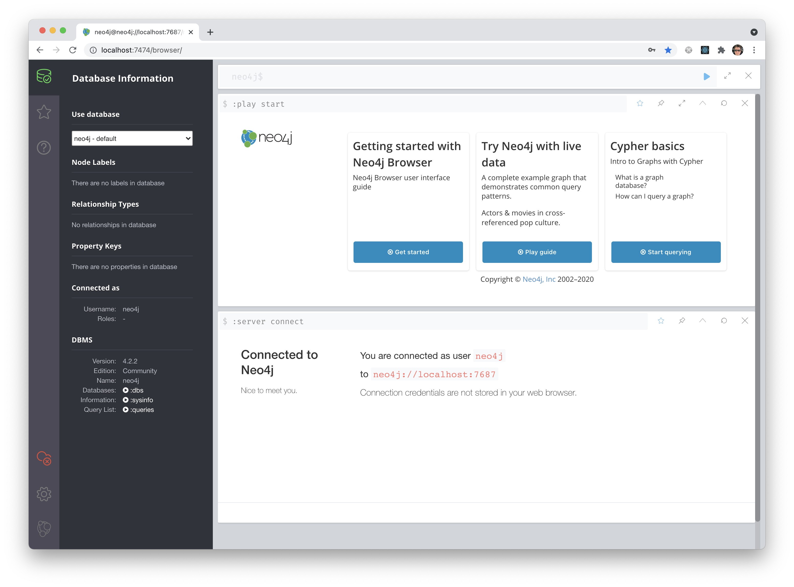

# Welcome

This project is a simple example of how to work with [Neo4j](https://neo4j.com) within a [Docker](https://www.docker.com) container.

All you need to have installed on your system to run this example is [Docker](https://www.docker.com).

If you do not have [Docker](https://www.docker.com) installed on your development system, you can download and install the freely available [Docker Desktop](https://www.docker.com/products/docker-desktop).

## Getting started

To spin up your Dockerized Neo4j instance:

```sh
# Use the existing Docker image on your system for your Neo4j instance
$ npm run dev

# OR #

# Force a clean build to ensure your Neo4j instance is using the latest code
$ npm run dev:clean
```

Once you have started your Neo4j instance, you can access the Neo4j Browser at [http://localhost:7474/browser/](http://localhost:7474/browser/) - using the following credentials:

- Username: `neo4j`
- Password: `letmein`


Once you've logged in, you are free to explore your Dockerized Neo4j instance.


